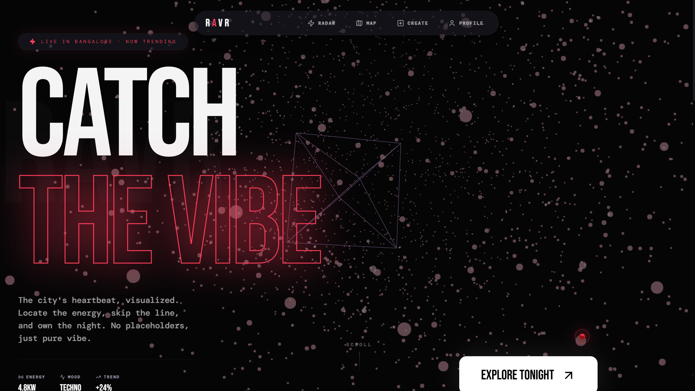

# 🦅 RAVR — Hyperlocal Cultural Radar

RAVR is a premium, Gen-Z focused event discovery platform designed for the pulse of the city. Built with a "Spotify for real-world events" aesthetic, it combines high-impact typography with interactive map-based discovery to help users catch the vibe happening right now.

 

## 🚀 Stack & Features

- **Framework**: `Next.js 16.1.6` (App Router) + `React 19`
- **Styling**: `Tailwind CSS` for a dark-mode, premium party aesthetic.
- **Animations**: `Framer Motion` for smooth transitions and interactive UI elements.
- **Maps**: `Leaflet` with custom dark-mode tiles and glowing markers.
- **Database**: `Supabase` for real-time event synchronization.
- **Typography**: `Bebas Neue`, `Syne`, and `DM Mono` for a distinct high-contrast feel.

### Key Highlights
- **Live City Radar**: Interactive map centered on **Bangalore (Bengaluru)** featuring real-time event clusters.
- **Vibe Match**: Each event features a "Vibe Score" and attendance tracking.
- **Interactive UI**: Sliding magnetic Navbar, global custom trail cursor, and dynamic heatmap backgrounds.
- **Responsive Design**: Optimized for both high-end laptops and mobile party-goers.

## 🛠️ Getting Started

### Prerequisites
- Node.js 18+ 
- NPM / PNPM

### Installation

1. Clone the repository:
   ```bash
   git clone https://github.com/ShashwatSahu21/RAVR-.git
   cd ravr
   ```

2. Install dependencies:
   ```bash
   npm install --force
   ```

3. Configure Environment:
   Create a `.env.local` file with your Supabase credentials:
   ```env
   NEXT_PUBLIC_SUPABASE_URL=your-supabase-url
   NEXT_PUBLIC_SUPABASE_ANON_KEY=your-anon-key
   ```

4. Run the development server:
   ```bash
   npm run dev
   ```

## 🗺️ Current Focus: Bangalore
The platform is currently localized to **Bangalore**, tracking underground raves in Indiranagar, rooftop sessions in Koramangala, and community runs in Cubbon Park.

## 🛠️ Technical Roadmap

### Phase 1: Vibe Engine (Current)
- [x] Three.js interactive landing page.
- [x] Responsive layout for event discovery.
- [x] Basic Supabase integration for event data.

### Phase 2: Live Interaction (Next)
- [ ] Real-time "Heatmap" showing crowd density at popular spots.
- [ ] User authentication and personalized "Vibe Mix."
- [ ] Community-driven event submissions with verification.

### Phase 3: Expansion & API
- [ ] WebSocket integration for live attendance count.
- [ ] Public RAVR API for local businesses and promoters.
- [ ] Cross-city support beginning with Mumbai and Delhi.

---
*Built with ❤️ for the city by [Shashwat Sahu](https://github.com/ShashwatSahu21)*
